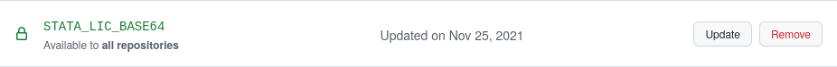
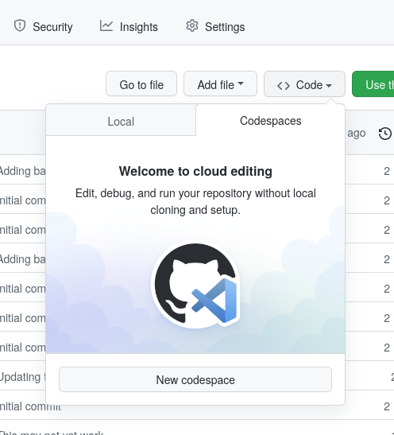

# Creating an environment for online and local reproducible Stata programming

## Purpose

This repository serves as a demonstration and a template on how to use Docker and Stata in a cloud environment using [Github Codespaces](https://github.com/features/codespaces). It can also be used for local development, which I comment on in the second part of this text.

This particular demonstration differs from the [AEADataEditor/stata-project-with-docker](https://github.com/AEADataEditor/stata-project-with-docker) demonstration in that it focuses on running Stata interactively in the cloud, instead of doing non-interactive, automated checks. The two purposes can be combined, but that has not been strongly incorporated here.

## Directory structure

The basic directory structure is as follows:

- `data/` will contain all data, if part of the repository. How to include large quantities of data (for which Github and similar repositories are not ideal) is not handled here.
- `code/` will contain all (Stata) code. 
- `/home/statauser/ado` contains all installed ado packages. 

## Requirements

You will need 

- [ ] Stata license file `stata.lic`. You will find this in your local Stata install directory.

To run this locally on your computer, you will need

- [ ] [Docker](https://docs.docker.com/get-docker/) 

([Singularity](https://github.com/sylabs/singularity/releases) might also work, but has not been tested)

To run this in the cloud, you will need

- [ ] A Github account, if you want to use the cloud functionality explained here as-is. Other methods do exist.
   - [ ] Your Github account must be enabled for [Github Codespaces](https://github.com/features/codespaces). You may need to ask somebody at your institution. It requires providing billing information. The expected cost for experimenting with this demonstration is a few cents.


## Setup

1. [ ] You should copy this template to your own personal space. You can do this in several ways:
   - Best way: Use the "[Use this template](https://github.com/labordynamicsinstitute/stata-project-with-docker-online/generate)" button on the [main Github page for this project](https://github.com/labordynamicsinstitute/stata-project-with-docker-online/). 
   - Good: [Fork the Github repository](https://github.com/labordynamicsinstitute/stata-project-with-docker-online/fork) by clicking on **Fork** in the top-right corner.
   - OK: [Download](https://github.com/labordynamicsinstitute/stata-project-with-docker-online/archive/refs/heads/main.zip) this project and expand on your computer. You will then need to [create a new repository on Github](https://github.com/new) manually, and connect the two.
2. [ ] Sync your code with your Github repository (which you created in Step 1, by using the template or forking)
3. [ ] Configure your Stata license in the cloud (securely) - see below - and possibly locally.
4. [ ] Verify that the code runs in the cloud

## Details

### Adjust the Dockerfile (optional)

There are TWO Dockerfiles  in this repository:

- [Dockerfile](Dockerfile) contains the build instructions for the automated processing. For the purposes of this demonstration, it is not used. See the [AEADataEditor/stata-project-with-docker](https://github.com/AEADataEditor/stata-project-with-docker) for further details.
- [.devcontainer/Dockerfile](.devcontainer/Dockerfile) is the Dockerfile used by the online computation, and which *may* need to be modified. 

For instance, you might want to use a more recent Stata version:

```
# syntax=docker/dockerfile:1.2
ARG SRCVERSION=17
ARG SRCTAG=2021-10-13
ARG SRCHUBID=dataeditors
```

Again, you might consult the [AEADataEditor/stata-project-with-docker](https://github.com/AEADataEditor/stata-project-with-docker) for more details. The default `Dockerfile` works as-is.


### Adjust the setup.do file

The template repository contains a `setup.do` as an example. It should include all commands that are required to be run for "setting up" the project on a brand new system. In particular, it should install all needed Stata packages. For additional sample commands, see [https://github.com/gslab-econ/template/blob/master/config/config_stata.do](https://github.com/gslab-econ/template/blob/master/config/config_stata.do). This can be used both for interactive and non-interactive use. A full reproducible repository will provide both the installed packages, as well as the scripts (here: `setup.do`) used to install those packages.

```
    local ssc_packages "estout"

    // local ssc_packages "estout boottest"
    
    if !missing("`ssc_packages'") {
        foreach pkg in `ssc_packages' {
            dis "Installing `pkg'"
            ssc install `pkg', replace
        }
    }
```
Note that the default configuration will re-install all packages each time the online environment is recreated. Ado files are installed in `/home/statauser/ado`, and re-installed everytime a container is rebuilt. This may not be desired in all cases.

## Cloud functionality

The basic functionality can be tested locally, which we do not detail here. To run this in the cloud, we now need to set up the Github Codespaces environment. This is a one-time setup for each Github "organization,' and does not need to be repeated for every repository.

### Checklist for cloud functionality

- [ ] Ensure that all users who need access have access. This requires users to have "collaborator" access to repositories, i.e., `read` and `write` access. 
- [ ] Configure the online Stata license, securely

### Configuring user access

Users need to have "collaborator" status. This is somewhat ambiguously defined, but turns out to be `read` and `write` access. Go to  `https://github.com/YOURORG/REPONAME/settings/access` to set that access on a per-repository level, or more generally in the `YOURORG` settings.

### Configure the Stata license in the cloud

Your Stata license is valuable, and should not be posted to Github! However, we need it there in order to run the Docker image. Github and other cloud providers have the ability to store "secure" environment variables, that are made available to their systems. Github calls these "[secrets](https://docs.github.com/en/actions/security-guides/encrypted-secrets)" because, well, they are meant to remain secret. However, secrets are text, not files. So we need a workaround to store our Stata license as a file in the cloud. You will need a Bash shell for the following step. You will need to generate the text, and copy and paste it in the web interface, as described [here](https://docs.github.com/en/actions/security-guides/encrypted-secrets). This could be done from a separate Github Codespaces instance!

> There is potential for some confusion, because (as of January 2022), Github has two types of "secrets": Those for Github Actions, and separately, those for Github Codespaces. You need to set those for Github Codespaces. This can be done at `https://github.com/organizations/YOURORG/settings/secrets/codespaces`. 

To run the image,  the license needs to be available to the Github Codespaces as `STATA_LIC_BASE64` in "base64" format. From a Linux/macOS command line, you can generate it like this:
 
```bash
cat stata.lic | base64
```

where `stata.lic` is your Stata license file. Then create a new organization secret called `STATA_LIC_BASE64`, and paste the information into the prompt. 



> An alternate method involves running the authorization code when building the Docker image. It requires more "secrets" to be set. This is not addressed here.

### Test the Cloud functionality

Assuming you have synced your git repository to Github, you should now be able to launch Codespaces from the Github interface, under the "Code -> Codespaces" button.

)

## Other options

If "continuous integration" is not a concern but a cloud-based Stata+Docker setup is of interest, both [CodeOcean](https://codeocean.com) and (soon) [WholeTale](https://wholetale.org) offer such functionality.

## Conclusion


## Comments

For any comments or suggestions, please [create an issue](https://github.com/labordynamicsinstitute/stata-project-with-docker-online/issues/new/choose) or contact us on [Twitter as @AeaData](https://twitter.com/AeaData).